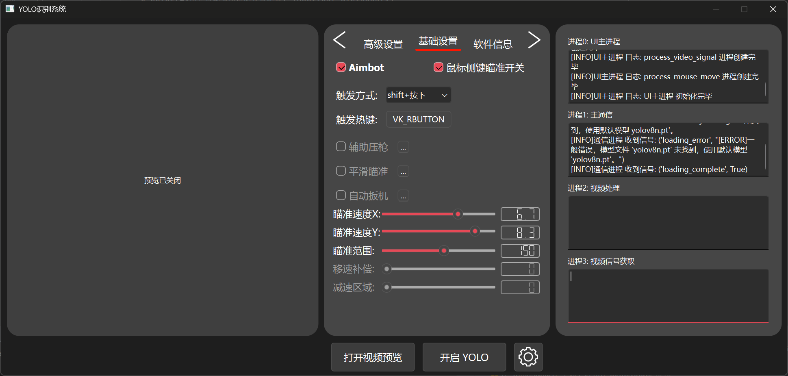

# RookieAI_yolov8_V3

加入Discord获取最新消息！

<div>
  <a href="https://discord.gg/vtgbfy2afb"></a>
<div>
  
## 版本要求

| Version | Python |
|---------|--------|
| `2.4.3或更早`   | 3.7+   |
| `2.4.4.2+`   | 3.10+   |

## 使用方法：

前言：为什么不提供直接打包成型的软件？

每个程序都有独立的特征码，如果大家都使用同一个程序，一旦其中一个人被BAN其他人会被联BAN。所以鼓励大家自行修改部分代码并自行打包即可避免此类情况发生。

使用前务必查看[参数说明文档](Parameter_explanation.md)

> [!Warning]
>
> 使用前请先阅读[参数解释文档](Parameter_explanation.md)
>
> 目前正在编写适用于新手的一键式启动器
>
> 如果你只是本地运行该项目，请**不要使用**pyinstaller打包 
> 
> 打包方法尚未完善，遇到问题也**不要提交**Issues，请自行解决

### 针对开发者：

1. ### 使用以下代码获取本代码需要的库与Pytorch库：

   **✨ 超高速无痛下载 ✨**
   
   ```shell
   pip install -r requirements.txt -i https://pypi.doubanio.com/simple/
   pip uninstall torch torchvision torchaudio
   pip install torch torchvision torchaudio -f https://mirror.sjtu.edu.cn/pytorch-wheels/torch_stable.html --no-index
   ```
   
   **海外用户请使用以下命令**
   
      ```shell
   pip install -r requirements.txt
   pip uninstall torch torchvision torchaudio
   pip install torch torchvision torchaudio -f https://download.pytorch.org/whl/torch_stable.html --no-index
   ```

2. ### 你还需要一个自己的模型（目前支持.pt/.engine/.onnx模型），如果没有可暂时使用ultralytics官方模型。

3. **当未找到模型时会自动下载YOLOv8n模型，你也可以⬇️**

   访问[YOLOv8GitHub界面](https://docs.ultralytics.com/)获取更多官方yolov8模型以快速开始
   
   访问[ultralytics官网](https://docs.ultralytics.com/)查看官方网站帮助文档
   
4. ### 运行

在脚本所在目录打开终端，键入以下内容并回车
```shell
python RookieAI_YOLOv8.py
```


### 针对想直接使用者：

参考开发者教程

### 关于模型文件

建议自行训练

学习资料：

[Bilibili](https://search.bilibili.com/all?keyword=%E5%A6%82%E4%BD%95%E8%AE%AD%E7%BB%83%E6%A8%A1%E5%9E%8B&from_source=webtop_search&spm_id_from=333.1007&search_source=5)

[YouTube](https://www.youtube.com/results?search_query=how+to+train+yolov8+model)

V3.0预告



3.0版本注重使用多线程进行优化，理论上可以提升截图效率与推理效率，但是可能会导致延迟问题。当然也提供原始的单进程推理模式可供选择。
该版本从底层代码到UI界面进行了完全重构，多线程也可以带来更多使用上的优化，例如可随意调整鼠标移动的频率，不再受到推理帧数的限制等。目前测试主系统空载YOLO使用YOLO11n模型推理的帧数从55提升到了80，有明显提升。配合独立的鼠标移动进程，理论上可以带来不错的使用体验。
对电脑配置的要求也会有一定程度的降低。代码目前处于早期开发阶段，未集成Aimbot等基础功能，开发进度与源代码请稍后关注对应文档。

### 推荐使用Atlas游戏系统配合boosterX性能优化软件获得更好体验

[AtlasOS](https://atlasos.net/)对 Windows 进行修改，专为游戏玩家设计。具有更高的游戏帧率和更低的延迟。同时在此系统上使用RookieAI可更高效的利用GPU资源得到更高的推理帧率。

[boosterX](https://boosterx.org/en/)是一款系统优化软件，优化Windows，降低延迟、提高 FPS。在AtlasOS系统上使用可进一步进行优化。

配置单：截图模式:mss  截图高/宽:320  显卡:RTX4080M  模型:YOLOv8s_TheFinals_teammate_enemy_04.engine

原版windows空载运行RookieAI2.4.3 对比 AtlasOS 空载运行RookieAI2.4.3：


### ✅✅✅注意✅✅✅

此项目最初目的为Apex的Aimbot，未考虑其他游戏，可能会出现因反作弊禁止WIN32移动方式而无法使用的情况！

已知游戏：**VALORANT**

面对日益增多的配置文件参数，我新建了参数解释文档，里面介绍了配置文件内所有参数的信息，前往[参数解释文档](Parameter_explanation.md)查看。

**🎉🎉🎉非常感谢由RicardoJoaquim提供的英文特别版本🎉🎉🎉**

### 最后想说的：

> [!Important]
> 由于底层代码问题，推理帧数始终优化不上去，目前的代码也找不到更多可优化的空间（已经有些屎山代码了），我正在考虑完全重写整个程序，包括但不限于：
> 使用PyQt6重写UI界面，使用多进程优化程序，优化整体代码逻辑架构等。敬请期待。

**目前学业繁忙，随缘更新，敬请谅解 :(**

## Star History

[](https://star-history.com/#Passer1072/RookieAI_yolov8)

### 更新日志：

[已迁移](CHANGELOG.md)

___

Current latest version: ###
