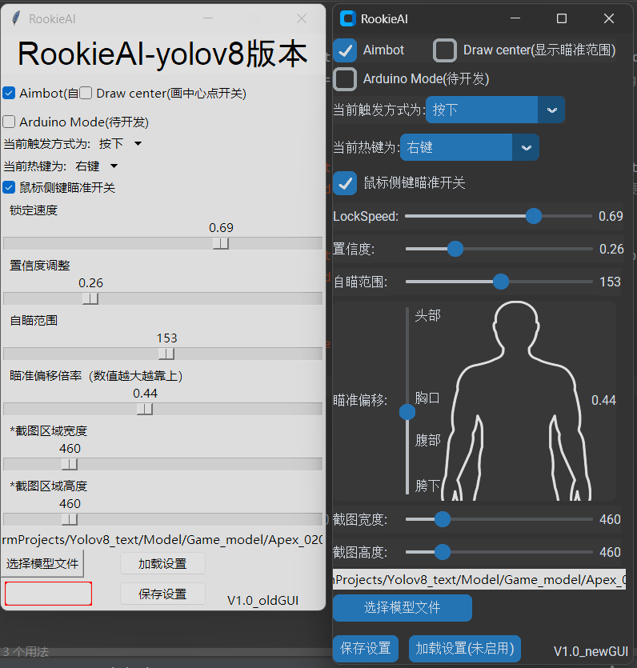
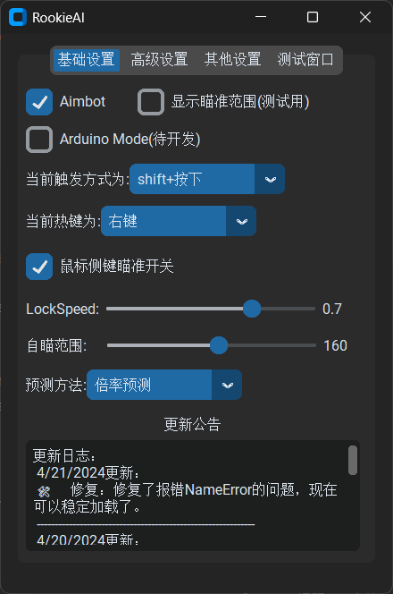

# RookieAI_yolov8   日志  
## 使用方法：  
前言：为维护环境不提供直接打包成型的软件，但开源代码鼓励自学。  

### 针对开发者：  
1. ### 使用以下代码获取本代码需要的库与Pytorch库：  
`pip install -r requirements.txt`   
`pip install torch==2.2.0 torchvision==0.17.0 torchaudio==2.2.0 --index-url https://download.pytorch.org/whl/cu121`  
2. ### 你还需要一个自己的模型（目前只支持.pt模型），如果没有可暂时使用ultralytics官方模型。  
**当未找到模型时会自动下载YOLOv8n模型，你也可以 ⬇️**  
_访问[YOLOv8 GitHub界面](https://docs.ultralytics.com/)获取更多官方yolov8模型以快速开始  
访问[ultralytics官网](https://docs.ultralytics.com/)查看官方网站帮助文档_  
3. ### 使用你的模型  
打开软件---选择模型文件---保存设置---关闭软件，重启软件。  
即可加载上选择的模型文件  
或者：  
修改默认文件地址：  
`# 默认的模型文件地址`  
`default_model_file = "yolov8n.pt"`  

### 针对想直接使用者：  
1. ### 使用以下代码获取本代码需要的库与Pytorch库：  
`pip install -r requirements.txt`   
`pip install torch==2.2.0 torchvision==0.17.0 torchaudio==2.2.0 --index-url https://download.pytorch.org/whl/cu121`  
2. ### 下载pyinstaller库(打包用)  
`pip install pyinstaller`  
3. ### 使用pyinstaller打包代码  
`pyinstaller xxxxx.py`    
将xxxxx替换为代码实际名称。  
更多打包参数介绍：[Python pyinstaller打包exe最完整教程](https://blog.csdn.net/qq_48979387/article/details/132359366)  
❗必定会遇到的问题：  
Q：运行提示`FileNotFoundError:`，问题：缺少库  
A：把编译器虚拟环境里的库全部复制粘贴到打包出的文件夹<_internal>里就可以了。参考：[打包后库不全解决办法](https://github.com/Passer1072/RookieAI_yolov8/issues/1#issuecomment-2041157885)  
5. ### 关于模型文件  
建议自行训练  
前往bilibili学习：[B站](https://search.bilibili.com/all?keyword=%E5%A6%82%E4%BD%95%E8%AE%AD%E7%BB%83%E6%A8%A1%E5%9E%8B&from_source=webtop_search&spm_id_from=333.1007&search_source=5)  
前往YouTube学习：[油管](https://www.youtube.com/results?search_query=how+to+train+yolov8+model)  
❗在软件中选择完模型文件后需保存重启后才会生效，因为需要重新加载模型。  
4. ### 文件整理  
将  
'_internal'(包含软件环境/库)  
'body_photo.png'（软件需要的图片1）  
'logo-bird.png'（软件需要的图片2）  
'程序.exe'（主程序）  
'settings.json'(参数保存)  
'模型文件.pt'（模型文件）  
放在同一目录下，直接运行exe文件即可。   
    
   
oldGUI版与newGUI版对比图：   
   
Ps:二者在最终使用效果上无任何区别，仅视觉差异     
  
🎉全新V2.0版本，全新布局，更好优化，更多设置      
   

✅✅✅注意✅✅✅  
此项目最初目的为Apex的Aimbot，未考虑其他游戏，可能会出现因反作弊禁止WIN32移动方式而无法使用的情况！  
已知游戏：VALORANT
 

  
更新日志：   
 4/21/2024更新：  
 🛠️修复：修复了报错NameError的问题，现在可以稳定加载了。   
 ------------------------------------------------------------- 
 4/20/2024更新：   
 🎉推出：V2.2版本，重新精简/分类各项设置页面   
 ➕新增1：推理延迟修正设置（预测）1.倍率预测2.像素预测     
 ➕新增2：可选择单个识别目标（需要模型支持，并且需要根据你的模型手动修改代码中的目标列表名字）     
 ➕新增3：软件内可开关的测试画面，方便调试设置    
 ➕新增4：一键重启软件按钮（用于更换模型后的快速重启以及报错后快速重启）    
 ➕新增5：加入更新公告栏（依赖于Github的README.md，可能需要科学上网才能加载）   
 🛠️优化：默认隐藏外部"frame_"调试窗口（可前往settings.json开启）以优化推理速度     
 ❗注意1："V2.2"版本的配置文件（settings.json）已更改，需要替换。    
 ❗注意2：github库已整理，历史版本与对应可使用的配置文件已整理到historic_version文件夹。    
 ❗❗已知问题：可能会报错nameError，会在后面版本进行修复，当前可以通过重启软件解决，并在属性中勾选“管理员启动”与“注册此程序以重新启动”可能会好一些  
 -------------------------------------------------------------   
 4/8/2024更新：  
 🎉推出：全新GUI版本，使用customtkinter库进行美化，界面更直观，简洁。  
 ➕新增：启动画面  
 📑创建：版本号现在起从V1.0开始计算（前面都当测试吧）  
 ❗注意："newGUI"版本需要两个新的图片文件，注意替换。  
 ❗注意："oldGUI"版本图片文件已移除，"oldGUI"版本已移除背景图相关代码。    
 -------------------------------------------------------------   
 4/2/2024更新：  
 ✨改进：独立出侧键触发开关，使其适用于任何按键触发方式，方便开关。  
 🛠️优化：优化整理触发判定代码，更统一易懂  
 ❗注意：配置文件内容已更改，新增了侧键保存参数，注意替换。  
 -------------------------------------------------------------  
 4/1/2024更新：    
 ✨改进：自瞄偏差。（之前只使用固定像素偏移达到垂直瞄准位置的效果，没有考虑敌人的远近距造成的影响， 近距离偏移过低，远距离偏移过高。    
 现改为计算目标中心点到上边框的距离乘以用户设置倍数的方式使远近距离偏移量都能在合适位置）。    
 🛠️优化：优化代码量，去除暂时未启用功能代码，加入更多批注方便阅读。    
 ➖移除：暂时移除压枪功能，测试不出意外中断原因，考虑独立出来。   
 🕳️未来计划：1.支持其他格式文件，例如ONNX。2.独立出"侧键触发"开关。   
 -------------------------------------------------------------  
 3/19/2024更新：  
 ➕新增：自定义压枪（经常失灵，就当没有，后面修）  
 ➕新增：新增侧键鼠标下侧键触发,贴脸腰射好用。（需选择"shift+按下"触发方式）  
 🎛️测试：经测试，支持最新YOLOv9,YOLOv5,YOLOv8。可自行训练YOLO模型并使用  
 📑创建：添加鼠标压枪参数文件,可自行调整。（只能垂直压枪，分为三段，可自己改更多段。有BUG用着用着压枪就没了...）  
 🕳️未来计划：1.支持其他格式文件，例如ONNX。2.独立出"侧键触发"开关。  
 -------------------------------------------------------------
 2/27/2024更新：  
 ➕新增：自定义微调自瞄位置（自瞄偏差）  
 ➕新增：可手动选择模型文件，应用范围更广   
 ✨改进：半透明UI界面  
 ✨改进：调参页面置顶  
 ❗注意：配置文件内容已更改，需替换为最新版
 -------------------------------------------------------------
 2/4/2024更新：  
 🛠️修复：文件无法手动选择，进程冲突导致的参数调整面板失效  
 📑创建：创建更新日志，从此开始记录每次的更新内容  
 -------------------------------------------------------------  
 2/25/2024更新：  
 📢立项：基于yolov8的FPS游戏自瞄软件  
 🤖更新：实现基本的自瞄功能等。
 -------------------------------------------------------------
 1/28/2024发布：  
 👼初次创建基于yolov8实现本地视频预处理项目
 -------------------------------------------------------------  

Current latest version: V2.2.4
