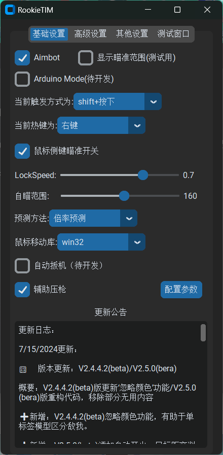

# RookieAI_yolov8日志
## 使用方法：
前言：为维护环境不提供直接打包成型的软件，开源代码鼓励自学。
使用前务必查看[参数说明文档](Parameter_explanation.txt)

### 针对开发者：

1. ### 使用以下代码获取本代码需要的库与Pytorch库：

<details>
<summary>CUDA 12.4或更高(无镜像)</summary>
   

```shell
pip install torch==2.4.0 torchvision==0.19.0 torchaudio==2.4.0 --index-url https://download.pytorch.org/whl/cu124
```
</details>

<details>
<summary>CUDA 12.0及以上(镜像源)</summary>

#### 对于python3.8版本，使用以下代码：

```shell
pip install -r requirements.txt
pip install torchvision==0.17.0 torchaudio==2.2.0
pip install https://mirrors.aliyun.com/pytorch-wheels/cu121/torch-2.2.0+cu121-cp38-cp38-win_amd64.whl --no-warn-script-location
```

#### 对于python3.9版本，使用以下代码：

```shell
pip install -r requirements.txt
pip install torchvision==0.17.0 torchaudio==2.2.0
pip install https://mirrors.aliyun.com/pytorch-wheels/cu121/torch-2.2.0+cu121-cp39-cp39-win_amd64.whl --no-warn-script-location
```

#### 对于python3.10版本，使用以下代码：

```shell
pip install -r requirements.txt
pip install torchvision==0.17.0 torchaudio==2.2.0
pip install https://mirrors.aliyun.com/pytorch-wheels/cu121/torch-2.2.0+cu121-cp310-cp310-win_amd64.whl --no-warn-script-location
```

#### 对于python3.11版本，使用以下代码：

```shell
pip install -r requirements.txt
pip install torchvision==0.17.0 torchaudio==2.2.0
pip install https://mirrors.aliyun.com/pytorch-wheels/cu121/torch-2.2.0+cu121-cp311-cp311-win_amd64.whl --no-warn-script-location
```

#### 对于python3.12版本，使用以下代码：

```shell
pip install -r requirements.txt
pip install torchvision==0.17.0 torchaudio==2.2.0
pip install https://mirrors.aliyun.com/pytorch-wheels/cu121/torch-2.2.0+cu121-cp312-cp312-win_amd64.whl --no-warn-script-location
```

</details>

2. ### 你还需要一个自己的模型（目前只支持.pt模型与TRT模型，暂不支持ONNX），如果没有可暂时使用ultralytics官方模型。

3. **当未找到模型时会自动下载YOLOv8n模型，你也可以⬇️**

_访问[YOLOv8GitHub界面](https://docs.ultralytics.com/)获取更多官方yolov8模型以快速开始_

_访问[ultralytics官网](https://docs.ultralytics.com/)查看官方网站帮助文档_

4. ### 使用你的模型
打开软件>选择模型文件>保存设置>关闭软件，重启软件。

即可加载上选择的模型文件

或者：

修改默认文件地址：

```
#默认的模型文件地址
default_model_file="yolov8n.pt"
```

### 针对想直接使用者：

> 如果您是开发者，无需阅读此步骤，使用终端运行即可

1. ### 使用以下代码获取本代码需要的库与Pytorch库：
```shell
pip install -r requirements.txt
pip install torch==2.2.0 torchvision==0.17.0 torchaudio==2.2.0 --index-url https://download.pytorch.org/whl/cu121
```

2. ### 下载pyinstaller库(打包用)

`pip install pyinstaller`

3. ### 使用pyinstaller打包代码

`pyinstaller xxxxx.py`

将xxxxx替换为代码实际名称。

更多打包参数介绍：[Pythonpyinstaller打包exe最完整教程](https://blog.csdn.net/qq_48979387/article/details/132359366)

❗必定会遇到的问题：

Q：运行提示`FileNotFoundError:`，问题：缺少库

A：把编译器虚拟环境里的库全部复制粘贴到打包出的文件夹<_internal>里就可以了。

参考：[打包后库不全解决办法](https://github.com/Passer1072/RookieAI_yolov8/issues/1#issuecomment-2041157885)

4. ### 关于模型文件

建议自行训练

学习资料：

[Bilibili](https://search.bilibili.com/all?keyword=%E5%A6%82%E4%BD%95%E8%AE%AD%E7%BB%83%E6%A8%A1%E5%9E%8B&from_source=webtop_search&spm_id_from=333.1007&search_source=5)

[YouTube](https://www.youtube.com/results?search_query=how+to+train+yolov8+model)

❗在软件中选择完模型文件后需保存重启后才会生效，因为需要重新加载模型。

5. ### 文件整理

将
```txt
_internal(包含软件环境/库)
body_photo.png（软件需要的图片1）
logo-bird.png（软件需要的图片2）
程序.exe（主程序）
settings.json(参数保存)
模型文件.pt（模型文件）
```

放在同一目录下，直接运行exe文件即可。

oldGUI版与newGUI版对比图：


Ps:二者在最终使用效果上无任何区别，仅视觉差异

🎉全新V2.0版本，全新布局，更好优化，更多设置



### 推荐使用Atlas游戏系统配合boosterX性能优化软件获得更好体验

[AtlasOS](https://atlasos.net/)对 Windows 进行修改，专为游戏玩家设计。具有更高的游戏帧率和更低的延迟。同时在此系统上使用RookieAI可更高效的利用GPU资源得到更高的推理帧率。

[boosterX](https://boosterx.org/en/)是一款系统优化软件，优化Windows，降低延迟、提高 FPS。在AtlasOS系统上使用可进一步进行优化。

配置单：截图模式:mss  截图高/宽:320  显卡:RTX4080M  模型:YOLOv8s_TheFinals_teammate_enemy_04.engine

原版windows空载运行RookieAI2.4.3 对比 AtlasOS 空载运行RookieAI2.4.3：


### ✅✅✅注意✅✅✅

此项目最初目的为Apex的Aimbot，未考虑其他游戏，可能会出现因反作弊禁止WIN32移动方式而无法使用的情况！

已知游戏：VALORANT

面对日益增多的配置文件参数，我新建了参数解释文档，里面介绍了配置文件内所有参数的信息，前往[参数解释文档](Parameter_explanation.txt)查看。

(；′⌒`)悲报：23号刚做好的可以适配valorant的版本由于拳头5/24的反作弊更新当场就似了:(

**🎉🎉🎉非常感谢由RicardoJoaquim提供的英文特别版本🎉🎉🎉**


### 更新日志：

8/16/2024更新：

🎛️版本更新：V2.5.3(beta)

概要：V2.5.3(beta)优化倍率预测，添加自瞄平滑(暂时与倍率预测绑定)

➕新增：鼠标移动平滑处理

➖移除：新分段瞄准模式，感觉没毛用

🛠️优化：倍率预测（效果依然不理想）

🛠️优化：分段瞄准逻辑:当目标进入软锁范围后，鼠标的移动速度会根据距离逐渐变化，而不是突然改变，从而更加平滑和自然的瞄准。

___

7/15/2024更新：

🎛️版本更新：V2.4.4.2(beta)/V2.5.0(beta)

概要：V2.4.4.2(beta)版更新‘忽略颜色’功能/V2.5.0(bera)版重构代码，移除部分无用内容

➕新增：V2.4.4.2(beta)忽略颜色功能，有助于单标签模型区分敌我。

➕新增：V2.5.0(beta)添加自动开火，目标距离判断正在测试

➖移除：V2.5.0(beta)移除随机特征码

🛠️优化：V2.5.0(beta)，[@molanp](https://github.com/molanp)对V2.4.3版本的代码进行优化

Python要求>=3.10

📑新增文件：V2.5.0(beta)

👋感谢：

[@molanp](https://github.com/molanp)：重构并优化V2.4.3版本代码。

[@CougarP](https://github.com/Cougarp)：对于颜色忽略功能的支持。

___

7/8/2024更新：

🎛️版本更新：V2.4.3

概要：V2.4.3正式版，添加辅助压枪功能。
➕新增：辅助压枪，参数可通过对应参数设置页面调整

➕新增：可在settings.json中将"deactivate_dxcam"设置为true禁用dxcam模块加载

🛠️优化：通过匿名API来请求更新公告，速度更快更稳定，每小时60次请求限制。

❗注意：配置文件(settings.json)发生变更，注意替换。

👋感谢：

[@molanp](https://github.com/molanp)：提供使用API请求更新公告的办法，使请求与加载速度更快更稳定！

🕳️V2.4.4计划：

自动扳机，停止瞄准范围。

___

7/3/2024更新：

🎛️版本更新：V2.4.2

概要：修复V2.4.1正式版的BUG

🛠️修复：死循环，意外弹窗，参数重置等恶性BUG

___

7/2/2024更新：

🎛️版本更新：V2.4.1

概要：V2.4.1正式版，添加完善更多功能的GUI页面。

➕新增：随机特征码

➕新增：随机窗口名

➕新增：鼠标移动库选择：

1. win32

2. mouse

3. 飞易来U盘

4. 罗技移动（需下载旧版GHUB，安装包在LGmouseControl文件夹中）

➕新增：x轴瞄准偏移

➕新增：随机瞄准偏移（随机瞄准部位）参数配置GUI，在弹出的额外窗口中设置随机瞄准区间以及切换位置速度

🛠️优化：控制台不再刷屏（除了调参拉进度条），FPS显示速度可在代码内调整

🛠️修复：修复Dxcam截图方式黑屏的BUG

❗注意：配置文件(settings.json)发生变更，注意替换。

❗注意：requirements.txt内添加了一些库

📑新增文件：

1. 罗技移动DLL（MouseControl.dll）

2. 罗技GHUB以及相关文件（LGmouseControl文件夹）

👋感谢：

[@loy0516](https://github.com/loy0516)：提出加入睡眠，防止刷在加载的建议。

[@CougarP](https://github.com/Cougarp)：提供英文版以及英文版特有功能：

1. 添加PID控制，使鼠标移动更平滑、更精确

2. 颜色忽略，识别检测框上方区域中的颜色，如果颜色与所选颜色匹配，则忽略框等。这些功能稍后会同步到中文版中。

🕳️V2.4.2计划：

垂直压枪，自动扳机，kmbox兼容

🤔请求：如果有更好用的鼠标移动库、移动方式，欢迎联系我，我会参考并添加到代码中！TY

___

6/21/2024更新：

🎛️版本更新：V2.4.1(test)

概要：该版本旨在提高软件稳定性安全性，绕过反作弊检测。提高软件代码的随机性。

➕新增：随机特征码。

➕新增：随机窗口名。

➕新增：随机瞄准偏移。

瞄准偏移功能参数详见[参数解释文档](Parameter_explanation.txt)

❗注意：配置文件发生变更，注意替换。

❗注意：测试版GUI不完善，新功能需要在配置文件内修改。

❗注意：测试版本已移动至Beta文件夹内

___

6/4/2024更新：

🎛️版本更新：V2.3.3(test)

➕新增：微调水平瞄准偏移功能（测试）。

❗注意：配置文件发生变更，注意替换。

❗注意：测试版GUI不完善，新功能需要在配置文件内修改。

❗❗已知问题：使用TRT模型可能会出现识别异常，边框异常的现象，建议多换几个TRT模型或使用PT模型。

🕳️V2.3.3计划：

1.加入垂直压枪功能；

2.完善水平瞄准偏移GUI页面；

3.推理参数兼容选择。
___

5/30/2024更新：

🎛️版本更新：V2.3.2

➕新增：对TRT模型的兼容。现在可以正常使用*.engine模型进行推理。

📑V2.4.0测试版：

易键鼠版本，基于v2.3.1修改。

仅推荐 __懂易键鼠的开发者__ 使用，该版本旨在绕过某些屏蔽win32移动方式的游戏使用（例如瓦，虽然已经似了），同时更难被检测。

目前处于半成品状态且需自行购入易键鼠U盘，不推荐小白使用。

___

5/12/2024更新：

🎛️版本更新：V2.3.1（正式版）

➕新增：分段瞄准四项参数的GUI模块，方便调整。

✨提示：软件窗口默认置顶

🛠️优化：优化部分代码，指定使用显卡推理（`device="cuda:0"`）。

___

4/27/2024更新：

🎛️版本更新：V2.3(test)测试版

➕新增：

1. 更快的截图方式（基于DXcam的优化版本bettercam），可在配置文件切换截图方式（MSS/bettercam）。

2. 现在可以在配置文件里开关是否加载公告。

3. 一键打开配置文件按钮，编辑配置文件更方便。

4. 推出分段瞄准功能（测试版），更好的瞄准体验，前往配置文件内开启。

📑新建：
[参数解释文档](Parameter_explanation.txt)(Parameter_explanation.txt)

该文件将介绍settings.json中所有参数的意义

❗注意：

1. 测试版GUI不完善，新功能需要在配置文件内开启与修改。

2. 更多说明注意事项请查看参数解释文档

3. 引入了新的截图库（bettercam），已添加到requirements.txt中。

4. 配置文件发生变更，注意替换！

🛠️优化：优化加载过程，但还是不稳定

🕳️未来计划：

~~完善V2.3版本GUI~~

自动扳机,平滑鼠标

___

4/22/2024更新：

➕新增：联网检测版本功能（依赖于Github的README.md，可能需要科学上网才能加载）。

✨提示：过时版本号为红色，最新版本号为绿色，点击版本号可快速跳转至Github界面。

❗注意：加载时间可能变长，加载时间不稳定，加载页面会出现无响应问题，等待几秒钟即可，问题已在调查。

🕳️未来计划：

~~使用贝塞尔曲线平滑鼠标~~

自动扳机,平滑鼠标

___

4/21/2024更新：

🛠️修复：修复了报错NameError的问题，现在可以稳定加载了。

___

4/20/2024更新：

🎉推出：V2.2版本，重新精简/分类各项设置页面

➕新增

1. 推理延迟修正设置（预测）
    - 倍率预测
    - 像素预测

2. 可选择单个识别目标（需要模型支持，并且需要根据你的模型手动修改代码中的目标列表名字）

3. 软件内可开关的测试画面，方便调试设置

4. 一键重启软件按钮（用于更换模型后的快速重启以及报错后快速重启）

5. 加入更新公告栏（依赖于Github的README.md，可能需要科学上网才能加载）

🛠️优化：默认隐藏外部"frame_"调试窗口（可前往settings.json开启）以优化推理速度

❗注意：

1. "V2.2"版本的配置文件（settings.json）已更改，需要替换。

2. github库已整理，历史版本与对应可使用的配置文件已整理到historic_version文件夹。

❗❗已知问题：可能会报错nameError，会在后面版本进行修复，当前可以通过重启软件解决，并在属性中勾选“管理员启动”与“注册此程序以重新启动”可能会好一些

___

4/8/2024更新：

🎉推出：全新GUI版本，使用customtkinter库进行美化，界面更直观，简洁。

➕新增：启动画面

📑新建：版本号现在起从V1.0开始计算（前面都当测试吧）

❗注意："newGUI"版本需要两个新的图片文件，注意替换。

❗注意："oldGUI"版本图片文件已移除，"oldGUI"版本已移除背景图相关代码。

___

4/2/2024更新：

✨改进：独立出侧键触发开关，使其适用于任何按键触发方式，方便开关。

🛠️优化：优化整理触发判定代码，更统一易懂

❗注意：配置文件内容已更改，新增了侧键保存参数，注意替换。

___

4/1/2024更新：

✨改进：

自瞄偏差。（之前只使用固定像素偏移达到垂直瞄准位置的效果，没有考虑敌人的远近距造成的影响，近距离偏移过低，远距离偏移过高。

现改为计算目标中心点到上边框的距离乘以用户设置倍数的方式使远近距离偏移量都能在合适位置）。

🛠️优化：优化代码量，去除暂时未启用功能代码，加入更多批注方便阅读。

➖移除：暂时移除压枪功能，测试不出意外中断原因，考虑独立出来。

🕳️未来计划：

1.支持其他格式文件，例如ONNX。

2.独立出"侧键触发"开关。

___

3/19/2024更新：

➕新增：自定义压枪（经常失灵，就当没有，后面修）

➕新增：新增侧键鼠标下侧键触发,贴脸腰射好用。（需选择"shift+按下"触发方式）

🎛️测试：经测试，支持最新YOLOv9,YOLOv5,YOLOv8。可自行训练YOLO模型并使用

📑新建：添加鼠标压枪参数文件,可自行调整。（只能垂直压枪，分为三段，可自己改更多段。有BUG用着用着压枪就没了...）

🕳️未来计划：

1.支持其他格式文件，例如ONNX。

2.独立出"侧键触发"开关。

___

2/27/2024更新：

➕新增：自定义微调自瞄位置（自瞄偏差）

➕新增：可手动选择模型文件，应用范围更广

✨改进：半透明UI界面

✨改进：调参页面置顶

❗注意：配置文件内容已更改，需替换为最新版

___

2/4/2024更新：

🛠️修复：文件无法手动选择，进程冲突导致的参数调整面板失效

📑新建：创建更新日志，从此开始记录每次的更新内容

___

2/25/2024更新：

📢立项：基于yolov8的FPS游戏自瞄软件

🤖更新：实现基本的自瞄功能等。

___

1/28/2024发布：

👼初次创建基于yolov8实现本地视频预处理项目

___

Current latest version: V2.4.3
